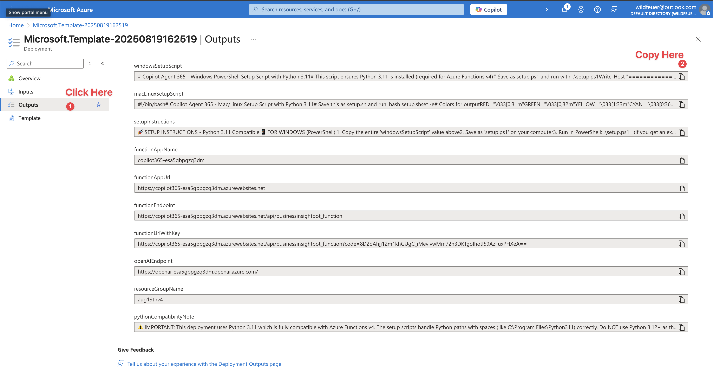

# Copilot Agent 365 - Enterprise AI Assistant
<a href='https://codespaces.new/kody-w/Copilot-Agent-365?quickstart=1'></a>

## 🚀 One-Click Setup - Fully Automated!

### Step 1: Deploy to Azure (1 minute)
[](https://portal.azure.com/#create/Microsoft.Template/uri/https%3A%2F%2Fraw.githubusercontent.com%2Fkody-w%2FCopilot-Agent-365%2Fmain%2Fazuredeploy.json)

### Step 2: Copy & Run Setup Script (2 minutes)

After deployment completes, you'll see "Your deployment is complete" ✅

1. Click the **"Outputs"** tab on the left sidebar (see screenshots below)
2. Find and copy the entire script value:
   - **Windows users**: Copy `windowsSetupScript` 
   - **Mac/Linux users**: Copy `macLinuxSetupScript`
3. Save it as a file and run:


*First, click on "Outputs" in the left sidebar*


*Then copy your platform's setup script*

**Windows (PowerShell):**
```powershell
.\setup.ps1
```
If you get a security error, first run: `Set-ExecutionPolicy RemoteSigned -Scope CurrentUser`

**Mac/Linux (Terminal):**
```bash
bash setup.sh
```

**That's it!** Your AI assistant is now running both in Azure and locally with all settings automatically configured. 🎉

---

## ✨ What You Get

- 🧠 **GPT-4 Powered** - Latest Azure OpenAI models
- 💾 **Persistent Memory** - Remembers conversations across sessions
- 🔐 **Enterprise Security** - Function-level authentication
- ⚡ **Auto-scaling** - Serverless Azure Functions
- 🎨 **Web Chat Interface** - Beautiful UI included
- 🔧 **Zero Configuration** - All Azure settings automatically configured
- 💼 **Microsoft 365 Integration** - Optional deployment to Teams & M365 Copilot (via Power Platform)
- 🤖 **Multi-Channel Support** - Web, Teams, M365 Copilot, or direct API access

## 🎯 Key Features

### Fully Automated Setup
- **Auto-installs Python 3.11** if not found (required for Azure Functions v4)
- **Handles all path issues** including spaces in "Program Files"
- **Configures all Azure settings** automatically from your deployment
- **No manual editing required** - everything just works!

### Memory System
- Stores conversation context per user
- Maintains shared knowledge base
- Persistent across sessions

### Agent System
- Modular agent architecture
- Easy to add custom agents
- Built-in memory management agents

## 📋 Prerequisites

The setup script will automatically install missing components, but you'll need:

### Windows
- **Azure Account** - [Get free trial](https://azure.microsoft.com/free/)
- **PowerShell** - Already installed on Windows
- Everything else auto-installs! ✨

### Mac/Linux
- **Azure Account** - [Get free trial](https://azure.microsoft.com/free/)
- **Python 3.9-3.11** - `brew install python@3.11` (Mac) or `apt-get install python3.11` (Linux)
- **Git** - `brew install git` (Mac) or `apt-get install git` (Linux)
- **Node.js** - `brew install node` (Mac) or from [nodejs.org](https://nodejs.org/)

Then install Azure Functions Core Tools:
```bash
npm install -g azure-functions-core-tools@4
```

## 🎯 Quick Start After Setup

Once setup is complete, you can start your bot anytime with:

### Windows
```powershell
cd Copilot-Agent-365
.\run.ps1
```

### Mac/Linux
```bash
cd Copilot-Agent-365
./run.sh
```

Then:
- **Local API**: http://localhost:7071/api/businessinsightbot_function
- **Web Chat**: Open `client/index.html` in your browser
- **Azure URL**: Automatically shown after setup (includes auth key)

## 💬 Test Your Bot

### PowerShell (Windows)
```powershell
Invoke-RestMethod -Uri "http://localhost:7071/api/businessinsightbot_function" `
  -Method Post `
  -Body '{"user_input": "Hello", "conversation_history": []}' `
  -ContentType "application/json"
```

### Curl (Mac/Linux)
```bash
curl -X POST http://localhost:7071/api/businessinsightbot_function \
  -H "Content-Type: application/json" \
  -d '{"user_input": "Hello", "conversation_history": []}'
```

## 🚀 Microsoft 365 & Teams Integration (Optional)

Your bot can run in two modes:
- **Standalone Mode** (what you just set up): Direct REST API access via Azure Functions
- **Power Platform Mode**: Full Microsoft 365 integration with Teams chat and M365 Copilot

### Why Integrate with Microsoft 365?

Deploy your AI assistant where your users already work:
- 💬 **Microsoft Teams** - Chat directly in Teams channels or personal chats
- 🤖 **M365 Copilot** - Deploy as a declarative agent in Microsoft 365 Copilot
- 👤 **User Context** - Automatically access user profile info (name, email, department)
- 🔐 **SSO Authentication** - Users authenticated via Azure AD/Entra ID
- 📊 **Enterprise Analytics** - Built-in usage tracking and compliance

### Prerequisites for Power Platform Integration

**Required Licenses (per user):**
- Microsoft 365 E3/E5 or Business Premium
- Power Automate Premium (if using premium connectors)
- Microsoft Teams (included in M365)
- Optional: Microsoft 365 Copilot license (for M365 Copilot deployment)

**Technical Requirements:**
- Admin access to Power Platform Admin Center
- Permissions to create Power Automate flows
- Copilot Studio access (included in Power Automate Premium)
- Your Azure Function URL + Function Key (from Step 2 above)

### Quick Setup Guide

#### Step 1: Download Power Platform Solution

1. Go to [Copilot-Agent-365 Releases](https://github.com/kody-w/Copilot-Agent-365/releases)
2. Download `Copilot365_PowerPlatform_Solution.zip`
3. Open [Power Apps](https://make.powerapps.com)
4. Navigate to **Solutions** → **Import Solution**
5. Upload the ZIP file and follow the wizard

#### Step 2: Configure Power Automate Flow

1. Open Power Automate: [flow.microsoft.com](https://flow.microsoft.com)
2. Go to **My flows** → Find **"Copilot365-Backend-Connector"**
3. Edit the flow and update the HTTP action:
   - **URI**: `https://your-function-app.azurewebsites.net/api/businessinsightbot_function`
   - **Headers**:
     - `Content-Type`: `application/json`
     - `x-functions-key`: `YOUR_FUNCTION_KEY` (from Azure setup)
4. Save and test the flow

The flow automatically:
- Captures user message from Copilot Studio
- Enriches with Office 365 user profile (name, email, ID)
- Calls your Azure Function backend
- Returns formatted response

#### Step 3: Connect Copilot Studio

1. Open [Copilot Studio](https://copilotstudio.microsoft.com)
2. Create a new copilot or edit existing one
3. Go to **Topics** → **Add a topic** → **From blank**
4. Create trigger phrases (e.g., "help me", "I need assistance")
5. Add action: **Call an action** → Select your Power Automate flow
6. Map variables:
   - Input: `Activity.Text` (user message)
   - Output: Display the response from Power Automate
7. Publish your copilot

#### Step 4: Deploy to Channels

**For Microsoft Teams:**
1. In Copilot Studio, go to **Channels** → **Microsoft Teams**
2. Click **Turn on Teams**
3. Follow prompts to publish to your organization
4. Users can find your bot in Teams app store (internal apps)

**For Microsoft 365 Copilot:**
1. Create a declarative agent manifest (JSON)
2. Include your Copilot Studio bot ID
3. Deploy via Teams Admin Center or App Catalog
4. Users will see your agent in M365 Copilot sidebar

#### Step 5: Enable User Context

Update your agent code to use Office 365 user information:

```python
from agents.basic_agent import BasicAgent

class PersonalizedAgent(BasicAgent):
    def __init__(self):
        self.name = 'Personalized'
        self.metadata = {
            "name": self.name,
            "description": "Provides personalized responses using user context",
            "parameters": {
                "type": "object",
                "properties": {
                    "user_context": {
                        "type": "object",
                        "description": "Office 365 user profile"
                    },
                    "query": {
                        "type": "string",
                        "description": "User query"
                    }
                },
                "required": ["query"]
            }
        }
        super().__init__(self.name, self.metadata)

    def perform(self, user_context=None, query="", **kwargs):
        user_email = user_context.get('email', 'Unknown') if user_context else 'Unknown'
        user_name = user_context.get('name', 'User') if user_context else 'User'

        return f"Hello {user_name} ({user_email}), I can help you with: {query}"
```

### Architecture Overview

```
User (Teams/M365) → Copilot Studio → Power Automate → Azure Function → Your Agents
                         ↓                  ↓              ↓
                    NLP/Dialog      User Context    Memory + OpenAI
                                   Enrichment
```

**Data Flow:**
1. User sends message in Teams or M365 Copilot
2. Copilot Studio processes natural language and intent
3. Power Automate enriches request with Office 365 user profile
4. HTTP POST to your Azure Function with user context
5. Azure Function routes to appropriate agents
6. Response flows back through Power Automate → Copilot Studio → User

### Cost Considerations

**Additional costs for Power Platform integration:**
- **Power Automate Premium**: ~$15/user/month (or $100/month for unlimited flows)
- **Copilot Studio**: Included in Power Automate Premium
- **Microsoft 365 Copilot**: ~$30/user/month (optional, only for M365 Copilot deployment)

**Total monthly cost estimate:**
- Standalone mode: ~$5/month + OpenAI usage
- With Power Platform: ~$25-40/user/month + OpenAI usage

### Troubleshooting Power Platform

| Issue | Solution |
|-------|----------|
| "Unauthorized" error in Power Automate | Check Function Key is correct in HTTP headers |
| User context not passed | Verify Office 365 Users connector in Power Automate has permissions |
| Copilot doesn't trigger | Check trigger phrases in Copilot Studio topics |
| Slow response times | Optimize Azure Function (enable Always On, or use Premium plan) |
| Teams app not found | Ensure copilot is published and approved by Teams admin |

### Security Best Practices

When integrating with Power Platform:

1. **Use managed identities** where possible instead of function keys
2. **Enable data loss prevention (DLP)** policies in Power Platform Admin Center
3. **Restrict access** to specific Azure AD security groups
4. **Audit logs** - Enable logging in both Azure and Power Platform
5. **Test in dev environment** before rolling out to production
6. **Monitor API usage** to prevent quota exhaustion

### Need Help?

- 📚 [Power Platform Documentation](https://learn.microsoft.com/power-platform/)
- 🤖 [Copilot Studio Docs](https://learn.microsoft.com/microsoft-copilot-studio/)
- 💬 [Community Forums](https://github.com/kody-w/Copilot-Agent-365/discussions)

---

## 🛠️ Customization

### Change Your Bot's Personality
Edit these in Azure Portal → Function App → Configuration:
- `ASSISTANT_NAME` - Your bot's name
- `CHARACTERISTIC_DESCRIPTION` - Your bot's personality

### Add Custom Agents
Create new file in `agents/` folder:
```python
from agents.basic_agent import BasicAgent

class MyCustomAgent(BasicAgent):
    def __init__(self):
        self.name = 'MyCustom'
        self.metadata = {
            "name": self.name,
            "description": "What this agent does",
            "parameters": {
                "type": "object",
                "properties": {
                    "input": {
                        "type": "string",
                        "description": "Input parameter"
                    }
                },
                "required": ["input"]
            }
        }
        super().__init__(self.name, self.metadata)
    
    def perform(self, **kwargs):
        input_data = kwargs.get('input', '')
        # Your logic here
        return f"Processed: {input_data}"
```

## 🔄 How It Works

### Deployment Process
1. **Azure deploys** all resources (OpenAI, Storage, Function App)
2. **Setup script** is generated with YOUR credentials embedded
3. **Running the script**:
   - Installs Python 3.11 if needed
   - Clones the repository
   - Creates `local.settings.json` with your Azure values
   - Sets up Python environment
   - Installs all dependencies
   - Creates run scripts

### No Manual Configuration!
The setup script automatically includes:
- ✅ Your Azure Storage connection string
- ✅ Your OpenAI API key and endpoint
- ✅ Your Function App details
- ✅ All other required settings

## 📁 Project Structure

```
Copilot-Agent-365/
├── function_app.py            # Main Azure Function
├── agents/                    # AI agents
│   ├── basic_agent.py        # Base agent class
│   ├── context_memory_agent.py
│   └── manage_memory_agent.py
├── utils/                     # Utilities
│   └── azure_file_storage.py
├── client/                    # Web UI
│   └── index.html
├── requirements.txt           # Python dependencies
├── host.json                  # Azure Functions config
├── run.ps1                    # Windows run script (auto-created)
├── run.bat                    # Windows batch script (auto-created)
├── run.sh                     # Mac/Linux run script (auto-created)
└── local.settings.json        # Azure settings (auto-created with YOUR values)
```

## 🚨 Troubleshooting

| Issue | Solution |
|-------|----------|
| "Python 3.11 not found" | Script auto-installs it! Just wait 2-3 minutes |
| "C:\Program Files" error | Fixed! Script handles spaces in paths |
| "func: command not found" | Run: `npm install -g azure-functions-core-tools@4` |
| Port already in use | Edit `run.ps1` or `run.sh` and change to `func start --port 7072` |
| "az login" needed | Run `az login` to deploy code to Azure (optional) |

## 💡 Python Version Important!
- **Use Python 3.11** (automatically installed by script)
- **Don't use Python 3.13+** (causes compatibility issues with Azure Functions)
- Script specifically installs and uses Python 3.11 to avoid issues

## 💰 Cost

### Standalone Mode (Azure only)
- **Function App**: ~$0 (free tier covers most usage)
- **Storage**: ~$5/month
- **OpenAI**: Pay per token used (~$0.01 per 1K tokens)

**Total: ~$5/month + OpenAI usage**

### Power Platform Mode (Microsoft 365 Integration)
- **Function App + Storage + OpenAI**: ~$5/month + usage (same as above)
- **Power Automate Premium**: ~$15/user/month
- **Microsoft 365 Copilot**: ~$30/user/month (optional)

**Total: ~$25-40/user/month + OpenAI usage**

> 💡 **Tip**: Start with standalone mode to test, then upgrade to Power Platform when you're ready to deploy to your organization.

## 🔐 Security

- **API keys are embedded securely** in the generated setup script
- **Never commit** `local.settings.json` to Git (contains secrets)
- **Function requires authentication** key for API access
- **All traffic uses HTTPS**
- **Keys are unique** to your deployment

## 🆕 What's New

### Version 2.1 - Power Platform Integration
- 🚀 **Microsoft 365 Integration** - Deploy to Teams and M365 Copilot
- 🤖 **Dual-mode support** - Run standalone or with Power Platform
- 👤 **User context enrichment** - Automatic Office 365 profile integration
- 📚 **Comprehensive guides** - Full setup documentation for both modes

### Version 2.0 - Full Automation
- ✨ **Auto-configuration** - No manual editing of settings
- 🔧 **Python path fix** - Handles "Program Files" spaces
- 🐍 **Python 3.11 auto-install** - Windows script installs if missing
- 📦 **Fixed package versions** - Prevents compatibility issues
- 🚀 **True one-click deploy** - Everything configured automatically

## 🗺️ Product Roadmap

### Q4 2025 (Current) - Foundation Enhancement
**Focus: Stability, Performance & Core Features** • *Oct-Dec 2025*

- **Enhanced Memory Management**
  - Advanced context search with semantic similarity
  - Memory compression for long-running conversations
  - Automated memory cleanup and archiving
  - Memory analytics dashboard

- **Agent Marketplace**
  - Web-based agent upload interface
  - Agent versioning and rollback capabilities
  - Community agent sharing and discovery
  - Agent performance metrics

- **Performance Optimization**
  - Response caching layer
  - Parallel agent execution
  - Connection pooling for Azure services
  - Reduced cold start times (<1s)

### Q1 2026 - Microsoft 365 Integration
**Focus: Enterprise Productivity Suite** • *Jan-Mar 2026*

- **M365 Agents**
  - Outlook email management (read, send, search, categorize)
  - Teams messaging and channel integration
  - SharePoint document search and retrieval
  - OneDrive file operations
  - Calendar management and scheduling

- **Authentication & Security**
  - Azure AD/Entra ID integration
  - Microsoft Graph API authentication
  - Role-based access control (RBAC)
  - Audit logging for compliance

- **Workflow Automation**
  - Automated email responses based on rules
  - Meeting summary generation from Teams
  - Document classification and tagging
  - Cross-app data synchronization

### Q2 2026 - Advanced AI Capabilities
**Focus: Intelligence & Automation** • *Apr-Jun 2026*

- **Multi-Agent Orchestration**
  - Agent chaining for complex workflows
  - Parallel agent execution with result aggregation
  - Conditional agent routing based on context
  - Agent team collaboration patterns

- **Advanced Analytics**
  - Business intelligence agent (data analysis, visualization)
  - Predictive insights from conversation patterns
  - Sentiment analysis and user satisfaction tracking
  - Custom reporting and dashboards

- **Document Intelligence**
  - PDF/Word/PowerPoint content extraction
  - Document summarization
  - Question-answering over documents
  - Citation and reference tracking

- **Voice & Multimodal**
  - Real-time voice conversation support
  - Image analysis and description
  - Audio transcription and summarization
  - Video content understanding

### Q3 2026 - Enterprise Scale & Governance
**Focus: Enterprise-Ready Platform** • *Jul-Sep 2026*

- **Multi-Tenancy**
  - Organization-level isolation
  - Department/team-specific agents
  - Cross-tenant security boundaries
  - Centralized admin console

- **Compliance & Governance**
  - Data residency controls
  - PII detection and masking
  - Retention policies and legal hold
  - SOC 2 Type II certification prep

- **Advanced Deployment Options**
  - Kubernetes/container deployment
  - Private endpoint support
  - Hybrid cloud deployment
  - High availability (HA) configuration

- **Enterprise Features**
  - SSO with multiple identity providers
  - Custom branding and white-labeling
  - Usage quota and billing per user/team
  - SLA monitoring and alerting

### Q4 2026 - Integration Ecosystem
**Focus: Platform Expansion** • *Oct-Dec 2026*

- **Industry-Specific Agents**
  - Healthcare compliance (HIPAA)
  - Financial services (SOX, PCI-DSS)
  - Legal document analysis
  - Manufacturing process optimization

- **Third-Party Integrations**
  - Salesforce CRM integration
  - ServiceNow ticketing
  - Slack and Discord support
  - Custom webhook connectors

- **AI Model Flexibility**
  - Multi-model support (GPT, Claude, Gemini)
  - Cost optimization through model routing
  - On-premises model deployment
  - Fine-tuning on organization data

### Future Vision (2027+)
**Focus: Innovation & AI-Driven Automation**

- **Advanced Automation**
  - Autonomous task execution
  - Proactive insights and recommendations
  - Self-healing workflows
  - Predictive business intelligence

- **Developer Platform**
  - SDK for custom integrations
  - GraphQL API
  - Event-driven architecture
  - Comprehensive API documentation
  - Low-code agent builder

- **Global Scale**
  - Multi-region deployment
  - Edge computing support
  - Real-time collaboration features
  - Advanced caching and CDN

---

### Roadmap Principles

✅ **Backward Compatibility** - All updates maintain existing functionality
✅ **Security First** - Every feature designed with enterprise security in mind
✅ **User-Centric** - Features driven by real user feedback and needs
✅ **Open Source** - Core platform remains free and community-driven
✅ **Scalable** - Architecture supports growth from individual to enterprise

### Request a Feature

Have an idea? [Submit a feature request](https://github.com/kody-w/Copilot-Agent-365/issues/new?labels=enhancement) or join our [discussions](https://github.com/kody-w/Copilot-Agent-365/discussions) to shape the future of Copilot Agent 365!

## 🤝 Contributing

1. Fork the repo
2. Create your feature branch (`git checkout -b feature/AmazingFeature`)
3. Commit changes (`git commit -m 'Add some AmazingFeature'`)
4. Push to branch (`git push origin feature/AmazingFeature`)
5. Open a Pull Request

## 📜 License

MIT License - See [LICENSE](LICENSE)

## 🆘 Support

- **Issues**: [GitHub Issues](https://github.com/kody-w/Copilot-Agent-365/issues)
- **Discussions**: [GitHub Discussions](https://github.com/kody-w/Copilot-Agent-365/discussions)

## 🌟 Why This Project?

This project makes enterprise AI accessible to everyone by:
- **Removing complexity** - One-click deployment with zero configuration
- **Handling all setup** - Automatically installs and configures everything
- **Providing memory** - Your AI remembers context across conversations
- **Enabling customization** - Easy to add your own agents and features

---

<p align="center">
  <strong>Deploy your own AI assistant in under 3 minutes!</strong>
  <br><br>
  <a href="https://github.com/kody-w/Copilot-Agent-365">⭐ Star this repo</a> if it helped you!
  <br><br>
  Made with ❤️ for the community
</p>
